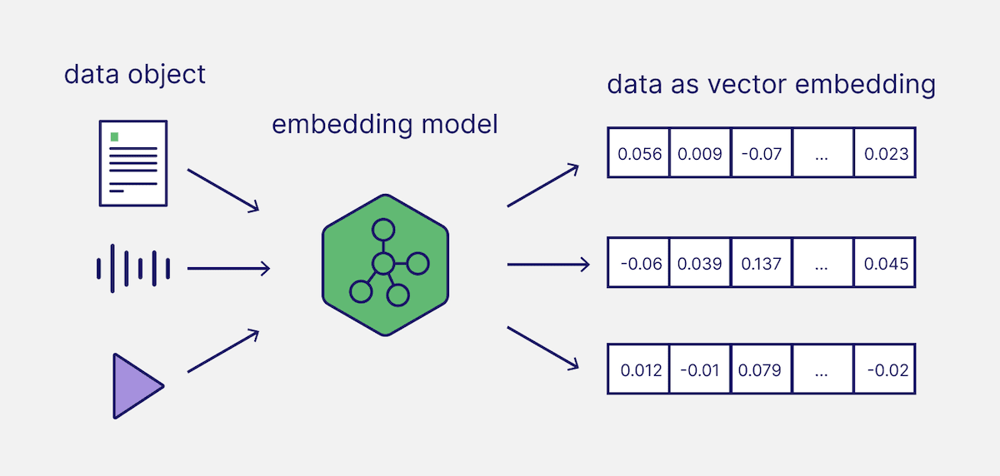

# 400x Faster - Static & Distilled Embedding Models

[Img: Weaviate](https://weaviate.io/blog/how-to-choose-an-embedding-model)

Embedding models are used for a multitude of AI related applications, playing major parts in semantic textual similarity, semantic search, paraphrase mining, text classification, clustering, and more. But one major problem is that the best embedding models, while lightweight in comparison to things like LLMs, can still be many millions of parameters. For example, popular models like [all-MiniLM-L6-v2](https://huggingface.co/sentence-transformers/all-MiniLM-L6-v2) and [bge-large-en-v1.5](https://huggingface.co/BAAI/bge-large-en-v1.5) are 22.7M & 335M parameters respectively.

Running these models then requires atleast some decent compute, and is commonly accelerated by GPUs. While small, scaling these workloads can get intensive and pricey. In this notebook we'll cover a few techniques (old and new!) that are used to squeeze efficiency out of embedding models, specifically:

**Static Embedding Models** and **Embedding Model Distillation**
